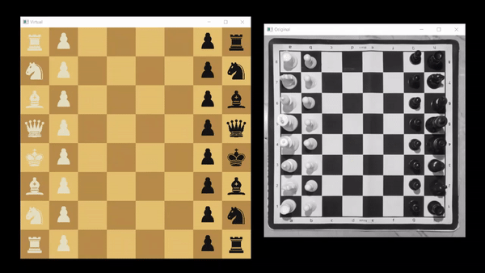

#### Real-time Tracking and Detection of Chess Piece Movement

Developed a chess piece movement detection model which will track and detect chess piece movements and display them on a virtual chess board. Our aim was to develop a real-time model, but we couldn't complete it within the given time frame. We have recorded a part of a chess match, and the movements we made on the chessboard are tracked and displayed on the virtual chessboard.

**Part A: Detection of Boundary of the Chess Board**

The initial frame of the match recording is used for boundary detection. The reference image is Gaussian blurred, followed by Canny edge detection to detect all the edges. The edges are enhanced using dilation followed by thresholding to either 0 or 255. The contours of the edges are obtained, and those having an area above a threshold are detected, among which the one with the smallest area corresponds to the chessboard boundary.

**Part B: Detection of Corner, Edge, and Intersection Points**

The corner points of the chessboard boundary are determined. The neighboring corner points are joined and divided, with each line into 16 divisions and 17 edge points. The even edge points of the divisions of parallel lines are connected. The intersection of these parallel lines will be the center points of each cell/grid points.

**Part C: Detection of Stable Frames**

The area of the chessboard boundary in the initial frame is taken as the reference value. We traverse through each frame and find the area of the contour corresponding to the chess boundary. The difference between the area of the reference and each frame will be compared to a threshold. If this difference is higher than the threshold, it will indicate the presence of a hand over the board. If the difference is less than or equal to the threshold, it ensures that no new movements have been made since the hand hasn't come over the board. A total of 50 consecutive frames without the presence of a hand are found, and the middle frame (25) among them is taken as the stable frame. This process is repeated until we have traversed through all the frames.

**Part D: Detection of Chess Piece Movement**

The stable frames identified above are Gaussian-filtered, Canny edge-detected, dilated, and thresholded. Consecutive stable frames are subtracted from each other and median-filtered. The contours of the median-filtered image are obtained, and the center of the biggest contour of the filtered image is identified and mapped to its closest point on the grid. The grid points are mapped to corresponding column and row indices.

**Part E: Displaying the Movements in the Virtual Chess Board**

Each chess piece is mapped to a unique number, which is positive for white pieces, negative for black, and zero if a cell is empty. Images of each piece are collected and displayed on the board for visualization. The movements are updated on the virtual board.

### Conclusion

Thus, we have developed a chess piece movement detection model (in Python) that tracks and displays the movements made on the real chessboard on the virtual board. Detailed explanations of the working and results of the algorithm can be found in the report.
